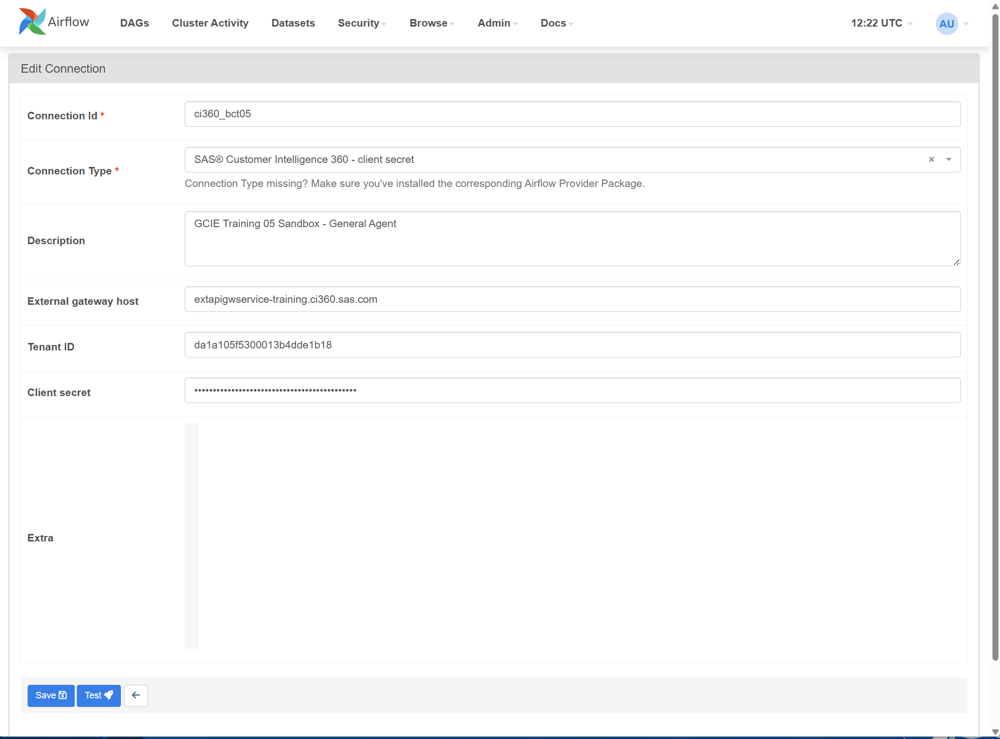
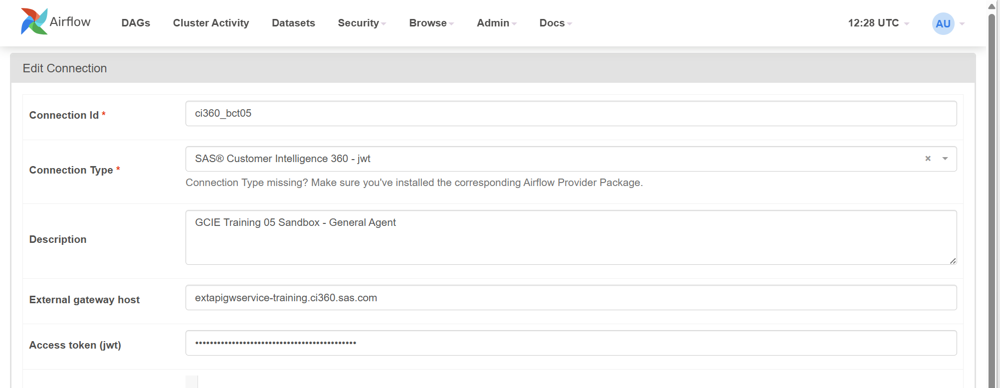
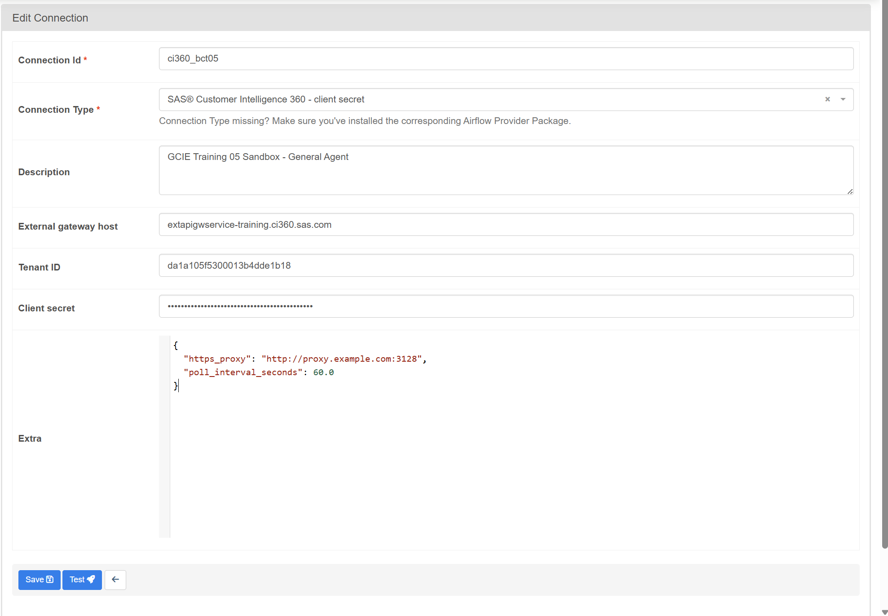
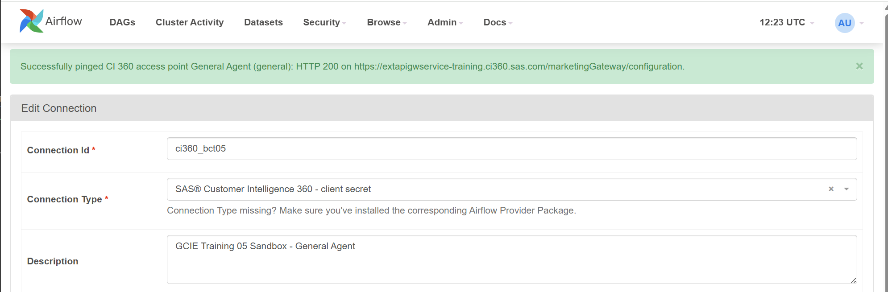
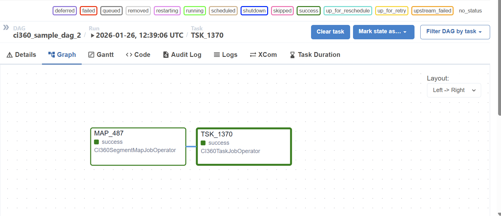

# SAS CI 360 -- Apache Airflow Provider

### Overview
Apache Airflow provider for orchestrating **SAS® Customer Intelligence 360 (CI 360)** tasks and segment maps using deferrable operators and native CI 360 APIs.

This provider:
-   Starts CI 360 task jobs and segment map jobs, and polls for execution status (non-blocking).
-   Surfaces final execution status.
-   Supports both client-secret and Access Token (JWT) authentication.

### Features

-   **Deferrable operators**
    -   Does not occupy worker slots while waiting for CI 360 execution.
    -   Uses Airflow triggers for scalable polling.
-   **Two authentication modes**
    -   Client Secret authentication
    -   JWT (access token) authentication
-   **Configurable runtime behavior**
    -   Poll interval
    -   Poll error timeout
    -   HTTP connect / read timeouts
    -   HTTPS proxy support
-   **Airflow 2 and Airflow 3 compatible**
    -   Automatically adapts to SDK changes internally.

### Whats new

| Release     |  Comments / changes                              |
|-------------| -------------------------------------------------|
| 1.0         |  Initial release                                 |


### Prerequisites

This tool is for CI 360 clients with Apache Airflow 2 or 3 running python 3.9 or later.
Users must have access to a CI 360 tenant, and should be familiar with Airflow and DAGs.

### Compatibility

  | Component       |  Supported                                       |
  |-----------------| -------------------------------------------------|
  | Python          |  3.9+                                            |
  | Apache Airflow  |  \>= 2.7, \< 4.0                                 |
  | Authentication  |  Client Secret, JWT                              |
  | Execution model |  Deferrable operators (trigger support required) |

## Installation

### Getting Started
1. Follow [Option 1](#option-1--install-from-github-release) or [Option 2](#option-2--install-directly-from-github-repository) below to install this provider. After install, you may need to restart Airflow to pick up the new connection types.
2. Set up a [connection](#connections) to your CI 360 tenant.
3. Use the [CI360TaskJobOperator](#ci360taskjoboperator) and/or [CI360SegmentMapJobOperator](#ci360segmentmapjoboperator) in a DAG. See [Exacple DAG](#example-dag).

### Option 1 — Install from GitHub Release
Download the latest wheel from the GitHub Releases page:

[Latest release](../../releases/latest)

and install it into your Airflow environment, e.g.:

```bash
pip install --upgrade sas_ci360_airflow_provider-*-py3-none-any.whl
```

### Option 2 - Install directly from GitHub repository 

Use pip to install diectly from the GitHub release:

```bash
pip install --upgrade https://github.com/sassoftware/ci360-airflow-provider/releases/latest/download/sas_ci360_airflow_provider-1.0.0-py3-none-any.whl
```

## Connections

The provider registers two Airflow connection types:

  | Connection Type         | Purpose                         |
  |-------------------------|---------------------------------|
  | sas-ci360-client-secret | Client secret authentication    |
  | sas-ci360-jwt           | JWT access token authentication |

Connections are configured in the Airflow UI or with the Airflow CLI.

### Client Secret Connection parameters

  | Field    |  Airflow prompt       | Description                                   |
  |----------|-----------------------|-----------------------------------------------|
  | Host     | External gateway host | CI 360 external gateway host                  |
  | Login    | Tenant ID             | Tenant ID                                     |
  | Password | Client secret         | Client secret                                 |
  | Extra    | Extra                 | Optional Extra JSON configuration (see below) |

Note that Airflow masks secrets in the UI. If you edit and save a connection, the client-secret must be re-entered.

Example:




### JWT Connection parameters

  | Field    |  Airflow prompt       | Description                                   |
  |----------|-----------------------|-----------------------------------------------|
  | Host     | External gateway host | CI 360 external gateway host                  |
  | Password | Access token (jwt)    | JWT access token                              |
  | Extra    | Extra                 | Optional Extra JSON configuration (see below) |

Note that Airflow masks secrets in the UI. If you edit and save a connection, the JWT must be re-entered.

Example:



### Extra JSON

A number of optional settings are configurable through *Extra JSON*. See below for settings and default values:

  | Attribute                         | Default value | Description                                                       |
  | ----------------------------------|---------------|-------------------------------------------------------------------|
  | `https_proxy`                     | *null*        | HTTPS proxy URL for connecting to the CI 360 external gateway API |
  | `poll_interval_seconds`           | 20.0          | How often the trigger polls CI 360 for job status                 |
  | `poll_error_timeout_seconds`      | 1800.0        | Maximum cumulative duration of consecutive polling errors         |
  | `start_connect_timeout_seconds`   | 20.0          | HTTP connect timeout on job start REST request                    |
  | `start_read_timeout_seconds`      | 120.0         | HTTP read timeout on job start REST request                       |
  | `status_connect_timeout_seconds`  | 5.0           | HTTP connect timeout on job status REST request                   |
  | `status_read_timeout_seconds`     | 30.0          | HTTP read timeout on job status REST request                      |

**Note**

Temporary network or API errors are tolerated during status polling.
If polling errors persist continuously beyond `poll_error_timeout_seconds`, the Airflow task fails.

#### Extra JSON example

```json
{
  "https_proxy": "http://proxy.example.com:3128",
  "poll_interval_seconds": 60.0
}
```




### Connection test

Connection test is supported with Airflow 2.

To validate the connection parameters, enter the client-secret or JWT token on the connection form, and press test:



### Use Airflow CLI to create a connection

To create a CI 360 connection with Client Secret authorization using the Airflow CLI, use:

- `--conn-login` to specify the Tenant ID
- `--conn-password` to specify the Client Secret

Example:
```bash
airflow connections add 'ci360_bct05' \
  --conn-type 'sas-ci360-client-secret' \
  --conn-description 'GCIE Training 05 Sandbox - General Agent' \
  --conn-host 'extapigwservice-training.ci360.sas.com' \
  --conn-login '***' \
  --conn-password '***'
```

To create a CI 360 connection with JWT authorization using the Airflow CLI, use:

- `--conn-password` to specify the Access Token (JWT)

Example:
```bash
airflow connections add 'ci360_bct04' \
  --conn-type 'sas-ci360-jwt' \
  --conn-description 'GCIE Training 04 Sandbox - General Agent' \
  --conn-host 'extapigwservice-training.ci360.sas.com' \
  --conn-password 'eyJ**.***.***'
```

## Operators

### CI360TaskJobOperator

Executes a CI 360 task and waits for completion.

Parameters

  | Name          | Value                  | Note
  |---------------|------------------------|----------------------------
  | task_id       | Airflow task ID        | Match the CI 360 task code (TSK_xxxx) for easy correlation between Airflow and CI 360.
  | conn_id       | Airflow connection ID  | Connection of type "SAS® Customer Intelligence 360 - client secret" or "SAS® Customer Intelligence 360 - client JWT"
  | ci360_task_id | CI 360 Task ID         | The CI 360 task to be executed
  

Example
```python
CI360TaskJobOperator(
  task_id='TSK_1370',
  conn_id='ci360_bct05',
  ci360_task_id='bc019976-fc25-434f-bf47-1bfd6bead98e'
)
```

XCom key: `ci360_task_job`

### CI360SegmentMapJobOperator

Executes a CI 360 segment map and waits for completion.

Parameters

  | Name                 | Value                 | Note
  |----------------------|-----------------------|----------------------------
  | task_id              | Airflow task ID       | Match the CI 360 segment map code (MAP_xxxx) for easy correlation between Airflow and CI 360.
  | conn_id              | Airflow connection ID | Connection of type "SAS® Customer Intelligence 360 - client secret" or "SAS® Customer Intelligence 360 - jwt"
  | ci360_segment_map_id | CI 360 Segment Map ID | The CI 360 segment map to be executed

Example
```python
CI360SegmentMapJobOperator(
  task_id='MAP_487',
  conn_id='ci360_bct05',
  ci360_segment_map_id='4d95d113-ac89-4d60-9a6c-6c2a60b0e1b3'
)
```

XCom key: `ci360_segment_map_job`

## Example DAG

```python
from datetime import datetime
from airflow import DAG
from airflow.providers.sas_ci360.operators import CI360TaskJobOperator, CI360SegmentMapJobOperator

with DAG(
  dag_id='ci360_sample_dag',
  start_date=datetime(2025, 1, 1),
  schedule=None,
  catchup=False,
) as dag:

  segment_map = CI360SegmentMapJobOperator(
    task_id='MAP_487',
    conn_id='ci360_bct05',
    ci360_segment_map_id='4d95d113-ac89-4d60-9a6c-6c2a60b0e1b3',
  )

  dm_task = CI360TaskJobOperator(
    task_id='TSK_1370',
    conn_id='ci360_bct05',
    ci360_task_id='bc019976-fc25-434f-bf47-1bfd6bead98e',
  )

  segment_map >> dm_task
```

### Running in Airflow:




## Limitations
-   Secrets are handled entirely by Airflow connections.


## Contributing

Maintainers are not currently accepting patches and contributions to this project.

## License

This project is licensed under the [Apache 2.0 License](https://gitlab.sas.com/ospo/starter-kit/-/blob/main/LICENSE).
